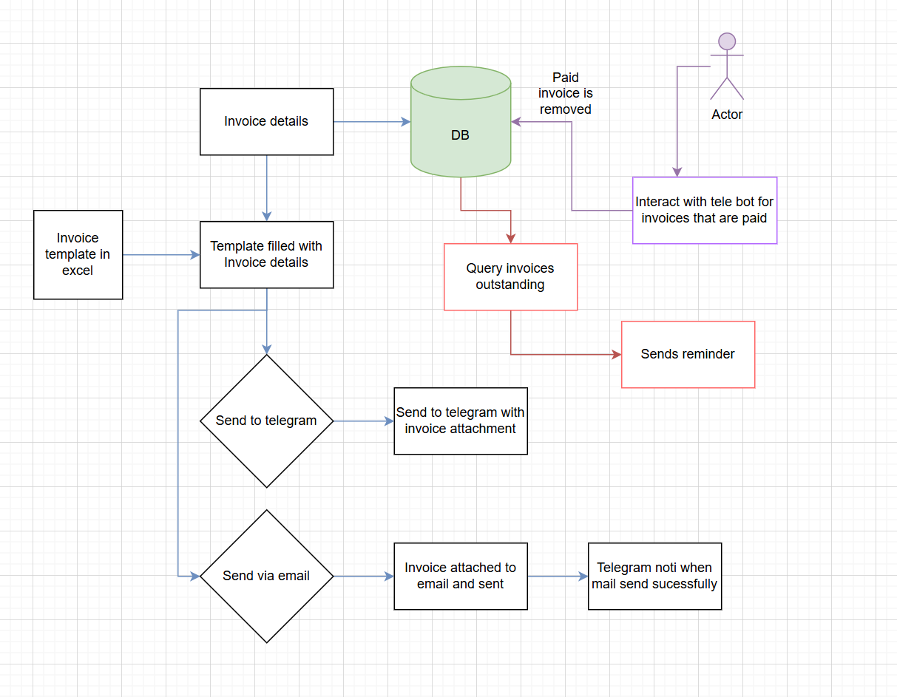

### How to use


1. ```cp .sample.env .env```
2. Add in the required variables as seen in the file. ```nano .env```
3. ```cp projects_list copy.py  projects_list.py```
4. Add in your projects and the details. ```nano projects_list.py```
5. ```python3 -m venv venv```
6. ```source venv/bin/activate```
7. ```pip install -r requirements.txt```
8. In `main.py` change the `send_mail` and `send_tele` and ```send_db``` to *True/False* depending on what you want.
9. ```pm2 start pm2.json```. If invoicing reminders or telegram interactive not needed, remove it from ```pm2.json```


#### Workflow




#### Notes

- Payments from clients are tracked using Arkm (https://intel.arkm.com/) and Cielo (https://cielo.finance/) for ERC20 and SPL respectively.
- Integrating automatic tracking of payments and invoicing reminders remains a challenge due to limited API resources on Solana.


#### Improvements

1. create a DB for pending invoices [done]
2. create an interactive telebot to remove invoice from DB when paid [done]
3. periodically check DB for outstanding invoices, if not paid, send reminder [done]
